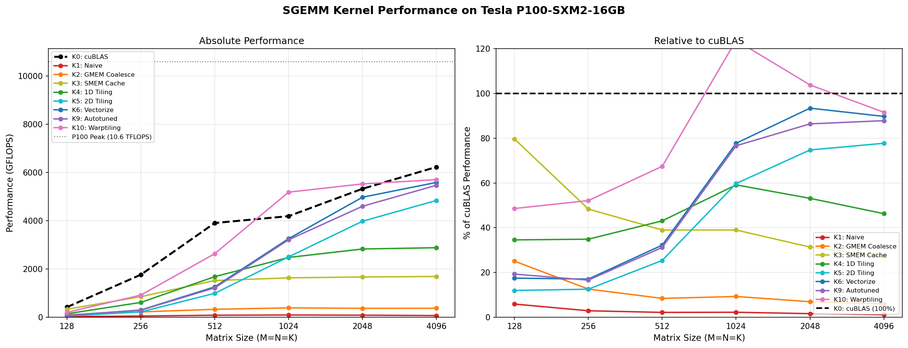

# P100 SGEMM 从零实现与逐步优化

在 **NVIDIA Tesla P100（sm\_60, Pascal 架构）** 上从零手写并逐步优化单精度矩阵乘法（SGEMM）的个人复现项目。
参考自 [siboehm/SGEMM\_CUDA](https://github.com/siboehm/SGEMM_CUDA)，针对 P100 硬件特性重新调整了 tiling 参数，
**以 cuBLAS 为 100% 性能基准**，衡量各优化内核的效率。

---

## 项目文件结构

```
GEMM项目/
├── CMakeLists.txt               # CMake 构建配置（sm_60，仅编译 sgemm 主程序）
├── Makefile                     # 快捷命令：build / debug / clean / bench / profile / sass
├── sgemm.cu                     # 主程序：接受内核编号参数，跑各规模 + 验证 + 计时
├── benchmark.py                 # 批量测试脚本：自动编译、运行所有内核、生成对比图
├── README.md                    # 本文档
├── LICENSE                      # 开源协议
├── .clangd                      # clangd LSP 配置（IDE 代码补全用）
│
├── src/
│   ├── kernels.cuh              # 汇总 include 所有内核头文件
│   ├── runner.cuh               # 声明 run_kernel / CudaDeviceInfo 等公共接口
│   ├── runner.cu                # 各内核的启动包装函数 + cuBLAS 调用 + 设备信息打印
│   └── kernels/
│       ├── 1_naive.cuh          # K1：朴素实现（每线程 1 元素，无复用）
│       ├── 2_kernel_global_mem_coalesce.cuh  # K2：GMEM 合并访问
│       ├── 3_kernel_shared_mem_blocking.cuh  # K3：共享内存分块缓存
│       ├── 4_kernel_1D_blocktiling.cuh       # K4：1D 寄存器 tiling（TM=8）
│       ├── 5_kernel_2D_blocktiling.cuh       # K5：2D 寄存器 tiling（TM×TN=64）
│       ├── 6_kernel_vectorize.cuh            # K6：float4 向量化 + A 转置加载
│       ├── 9_kernel_autotuned.cuh            # K9：综合优化，模板参数调优
│       └── 10_kernel_warptiling.cuh          # K10：Warp 级 tiling，最高性能
│
├── scripts/
│   ├── kernel_9_autotuner.sh   # K9 参数网格搜索（遍历 BM/BN/BK/TM/TN 组合）
│   └── kernel_10_autotuner.sh  # K10 参数网格搜索（遍历 WM/WN/WNITER/TM/TN 等）
│
└── benchmark_results/           # 自动生成：各内核原始输出 txt + 自动调优结果
```

> **内核 0 = cuBLAS**（通过 `runCublasFP32` 调用，作为 100% 性能基准）。
> 内核 7、8（银行冲突解决）和内核 11、12（双缓冲，依赖 sm\_80+ 的 `cuda::memcpy_async`）已从本项目删除。

---

## 硬件环境

| 规格 | 参数 |
|---|---|
| GPU | NVIDIA Tesla P100 SXM2 16GB |
| 架构 | Pascal（sm\_60） |
| 显存 | 16 GB HBM2 |
| 显存带宽 | ~720 GB/s |
| FP32 算力 | 10.6 TFLOPS |
| SM 数量 | 56 |
| 每 SM 共享内存 | 48 KB |
| 每 SM 寄存器 | 65536 |
| Warp Size | 32 |
| 注意 | sm\_60 不支持 `__ldg` 以外的 cache hint，无 L2 prefetch 指令 |

---

## 各内核优化思路

### K1：朴素实现（Naive）
每个线程计算 C 中的一个元素，直接读取全局内存（HBM2）中的 A 和 B，完全没有数据复用。
属于极端 Memory Bound 场景，作为最低性能参考。

### K2：全局内存合并访问（GMEM Coalescing）
将线程索引重映射为 1D，使同一 Warp 内相邻线程访问连续内存地址，触发 128B 事务合并。
P100 的 HBM2 控制器对合并访问高度优化，此步可将有效带宽提升 3~5 倍。

### K3：共享内存分块缓存（SMEM Blocking）
将 A 和 B 的 32×32 子块加载到片上共享内存（延迟 ~2 个时钟 vs. HBM2 ~500 个时钟），
利用 K 方向的数据局部性，显著减少全局内存访问总量，开始进入 Compute Bound 区间。

### K4：1D 寄存器 Tiling（BM=64, BN=64, BK=8, TM=8）
每线程在 M 方向计算 TM=8 个连续输出元素，用寄存器数组缓存中间结果。
减少 SMEM 读取频率，使算术强度达到约 16 FLOP/B，跨越 Roofline 转变点。

### K5：2D 寄存器 Tiling（BM=128, BN=128, BK=8, TM=8, TN=8）
将 tiling 扩展到 M 和 N 两个维度，每线程计算 8×8=64 个输出元素。
引入 regM、regN 两个寄存器数组分别缓存 As 列和 Bs 行，大幅降低 SMEM 带宽需求。

### K6：向量化内存访问（Vectorized float4）
在 K5 基础上，使用 `float4` 128bit 宽加载指令，减少内存事务数量。
加载 A 时同步完成转置写入（列优先存入 As），使后续按 dotIdx 读取时访问连续。
P100 支持 128bit 对齐的 float4 访问，此优化对 HBM2 带宽利用率影响显著。

### K9：综合调优版（Autotuned，P100 参数）
整合 SMEM 分块 + 2D 寄存器 tiling + float4 向量化，通过模板参数实现编译期调优。
针对 P100 设置 **BK=8**（相比 A6000 的 16），降低每块 SMEM 占用（8 KB），提升 SM 占用率。
参数：BM=128, BN=128, BK=8, TM=8, TN=8，256 线程/块。

### K10：Warp-level Tiling（P100 参数）
在 block tiling 之上进一步细分：每个 Warp（32 线程）独立负责一个 WM×WN 子矩阵。
以 `loadFromGmem` / `processFromSmem` 两阶段分离加载与计算，提升 Warp 级数据局部性。
针对 P100 缩小块级分块（BM/BN: 128→64），适配 P100 的 Warp 调度策略（56 SM）。
参数：BM=64, BN=64, BK=16, WM=32, WN=32, WNITER=2, TM=4, TN=4，128 线程/块。

---

## Roofline 分析

P100 的计算 / 带宽 Roofline 转变点（Ridge Point）：

```
Ridge Point = 10,600 GFLOPS ÷ 720 GB/s ≈ 14.7 FLOP/Byte
```

| 内核 | 算术强度（估算） | 瓶颈 |
|---|---|---|
| K1 Naive | ~0.5 FLOP/B | Memory Bound |
| K2 GMEM Coalesce | ~1 FLOP/B | Memory Bound |
| K3 SMEM Block | ~8 FLOP/B | 趋近转变点 |
| K4 1D Tiling | ~16 FLOP/B | **转变点** → Compute Bound |
| K5 ~ K10 | >32 FLOP/B | Compute Bound |

从 K3 → K4 是 Memory Bound → Compute Bound 的关键跳变。K5 以后的优化主要挖掘指令级并行（向量化、Warp 调度）和寄存器复用效率。

---

## 编译与运行

### 环境依赖

- CUDA Toolkit 10.2+（含 cuBLAS）
- CMake ≥ 3.19，或直接用 nvcc 命令行编译
- GCC 4.8.5+（ppc64le / x86\_64 均可）
- Python 3.6+（仅 benchmark.py 需要：`pip install matplotlib`）

### 快速开始

```bash
# 1a. 编译（CMake，Release 模式）
make build
# 或手动：
mkdir build && cd build && cmake -DCMAKE_BUILD_TYPE=Release .. && make -j$(nproc)

# 1b. 直接用 nvcc 编译（CUDA 10.2 + gcc 4.8.5 / ppc64le 环境）
mkdir -p build
nvcc -O3 -arch=sm_60 -I src sgemm.cu src/runner.cu -lcublas -o build/sgemm

# 2. 运行单个内核（以内核 10 为例）
./build/sgemm 10
# 有效内核号：0（cuBLAS）、1、2、3、4、5、6、9、10

# 3. 运行全部 benchmark 并生成图表
python3 benchmark.py
# 结果：benchmark_result.png（双图：绝对 GFLOPS + 相对 cuBLAS 百分比）
```

### 在 P100 服务器上测试（SSH 环境）

```bash
# 查看可用 GPU
nvidia-smi

# 指定 GPU 编号（多卡时）
DEVICE=0 ./build/sgemm 10

# 批量测试（matplotlib 无需 display，benchmark.py 已使用 Agg 后端）
python3 benchmark.py

# 仅重新绘图（无需再次运行内核）
python3 benchmark.py --plot-only

# 跳过编译步骤（已有可执行文件时）
python3 benchmark.py --no-build

# Debug 编译（保留设备代码调试符号，性能会大幅下降）
make debug
```

### Nsight Compute 性能剖析

```bash
# 对内核 10 进行完整剖析
make profile KERNEL=10
# 结果保存到 benchmark_results/kernel_10.ncu-rep

# 用 GUI 打开报告（在本地机器上）
ncu-ui benchmark_results/kernel_10.ncu-rep

# 查看 PTX / SASS 汇编
make sass KERNEL_FUNC=Warptiling
# 输出：build/kernel.sass  build/kernel.ptx
```

### 参数自动调优（网格搜索）

```bash
# 先编译
make build

# 对 K9 遍历 BM/BN/BK/TM/TN 的所有合法组合
bash scripts/kernel_9_autotuner.sh
# 结果：benchmark_results/kernel_9_autotune_results.txt

# 对 K10 遍历 WM/WN/WNITER/TM/TN 等参数
bash scripts/kernel_10_autotuner.sh
# 结果：benchmark_results/kernel_10_autotune_results.txt
```

---

## Benchmark 结果

测试环境：**NVIDIA Tesla P100-SXM2-16GB**，矩阵规模 M=N=K=4096，重复 50 次取平均。
以 cuBLAS（内核 0）为 100% 性能基准。

| 内核 | GFLOPS | 占 cuBLAS % |
|---|---:|---:|
| K1 Naive | 71 | 1.1% |
| K2 GMEM Coalesce | 373 | 6.0% |
| K3 SMEM Cache | 1689 | 27.1% |
| K4 1D Tiling | 2882 | 46.3% |
| K5 2D Tiling | 4839 | 77.7% |
| K6 Vectorize | 5587 | 89.7% |
| K9 Autotuned | 5468 | 87.8% |
| **K10 Warptiling** | **5701** | **91.6%** |
| K0 cuBLAS | 6226 | 100% |



---

## 与 siboehm 原项目的主要差异

| 方面 | 原项目（A6000, sm\_86） | 本项目（P100, sm\_60） |
|---|---|---|
| 目标 GPU | NVIDIA RTX A6000 | NVIDIA Tesla P100 |
| Compute Capability | sm\_86 (Ampere) | sm\_60 (Pascal) |
| 保留内核 | K1~K12 | K1~K6, K9, K10 |
| 删除内核 | — | K7/K8（银行冲突）、K11/K12（双缓冲需要 sm\_80+ async copy） |
| K9 BK 参数 | BK=16 | **BK=8**（减小 SMEM 压力，提升 SM 占用率） |
| K10 块级分块 | BM=BN=128 | **BM=BN=64** |
| K10 Warp 分块 | WM=WN=64, WNITER=4, TM=8 | **WM=WN=32, WNITER=2, TM=4** |
| 性能基准 | cuBLAS（描述中提及） | **cuBLAS = 100%，benchmark.py 直接标注** |
| benchmark 脚本 | gen\_benchmark\_results.sh + plot\_benchmark\_results.py | **benchmark.py（一键编译+测试+绘图）** |
